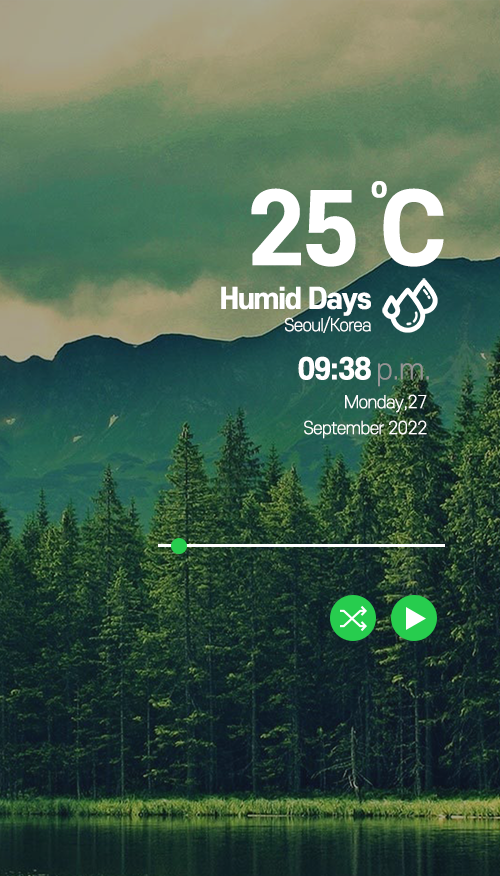

# Ambient Player by weather

## 목표

1. 날씨 `api`를 이용하여 날씨 정보를 받아온다.
2. 날씨에 따른 분위기의 음악을 추천
3. 시간 때 별 분위기의 음악 추천
4. 날씨에 맞는 배경 이미지

---

## 기술 스택

1. React
2. Styled-componets
3. react-query
4. recoil

---

## 작업 진행

- geolocation api를 이용하여 사용자의 위도와 경도 받아온다
- openweathermap api를 이용하여 사용자 위치의 현재 날씨를 받아옴
- unsplash api에 openweathermap에서 받은 날씨정보를 query로 전달하고 이미지 검색으로 받아온 이미지`url`을 `props`로 전달하여 적용
